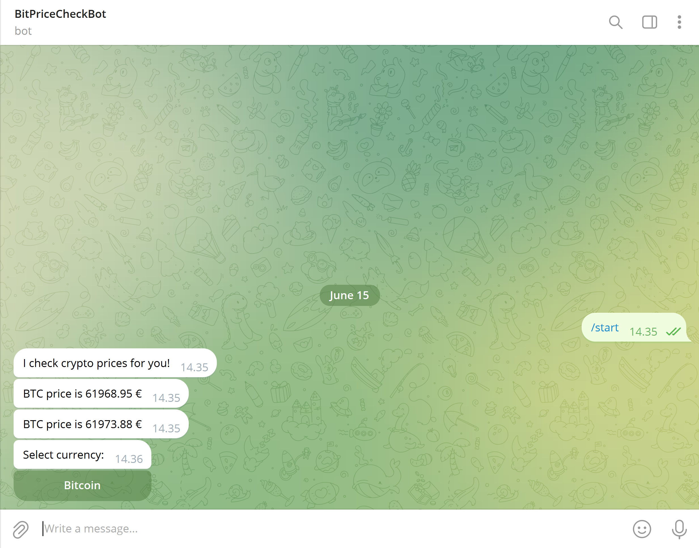

<!-- PROJECT LOGO -->
 

  

  <h3 align="center">Telegram cryptobot</h3>

  

    Check prices of cryptos by clicking a button

  

<!-- ABOUT THE PROJECT -->
## About The Project

BitPriceCheckBot is a telegram bot that displays the price of cryptocurrency with just a click of a button.

### Built With

## Use my bot

[Contact BitPriceCheckBot](https://t.me/BitPriceCheckBot) and follow given instructions.

## Run your own bot

### Prerequisites

Python 3.8 +

### Steps
1. Obtain telegram API key. [See here](https://core.telegram.org/bots/tutorial#obtain-your-bot-token)
2. Set the API key value as environment variable called `TELEGRAM_API_KEY`
3. Install requirements: ``pip install requirements.txt``
4. Start: ``python pricebot.py``
5. Access the bot via telegram
